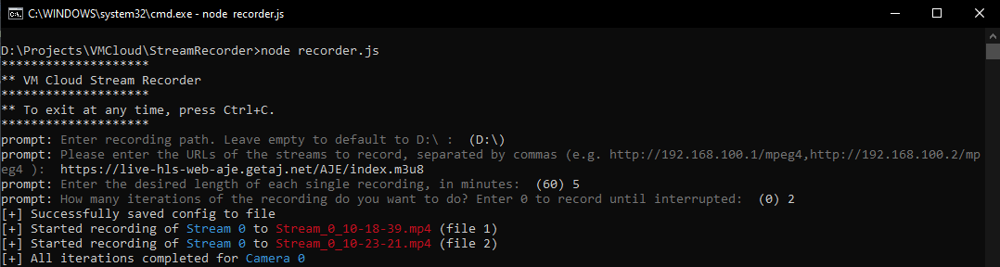
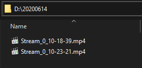

# Stream Sentinel

Interactive CLI utility to record (multiple) video streams to rotating segments (hourly, half-hourly, daily, ..etc). Suitable for CCTV, Live TV, and more.
The user is asked to provide a link to a stream, the rotation frequency in minutes, and how many rotations to do. The scripts records every n minutes (as given) into a separate file, and splits them into folders by day to facilitate 24-hour recording. 

## Dependencies

For the script to run, ffmpeg must be installed and in path. See https://www.ffmpeg.org/download.html for information.

## Usage

	git clone https://github.com/0x41mmarVM/StreamSentinel
	npm install
	node recorder.js`

## Config

Input gathered through the interactive prompt is automatically saved into config.json, and the user is offered to reload config on startup. Function `loadConfig` can easily be modified to skip the prompt altogether and run this as a service if necessary. Suggestions on how to best offer this are welcome.